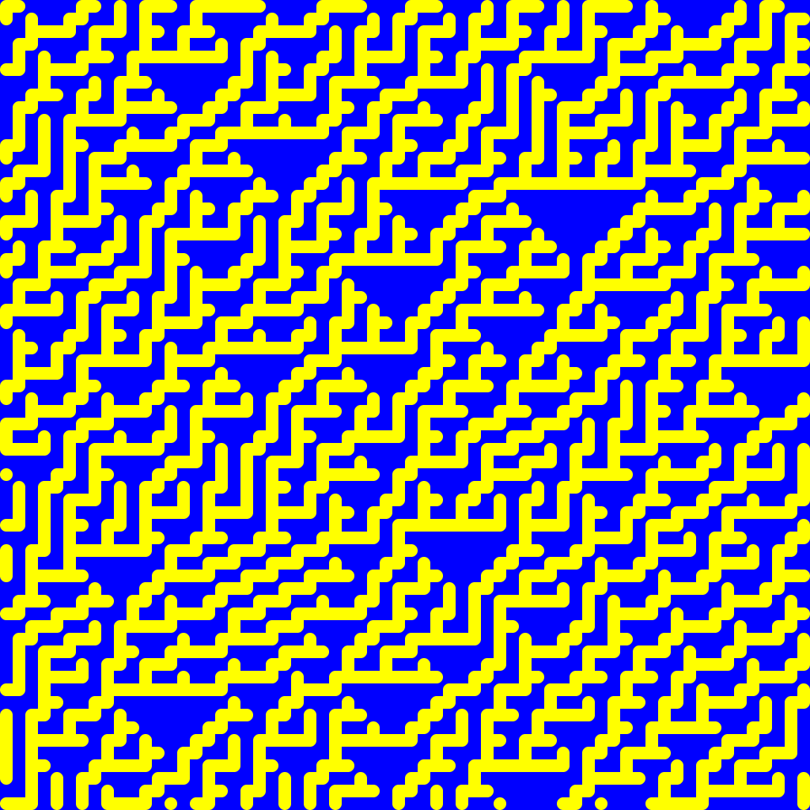
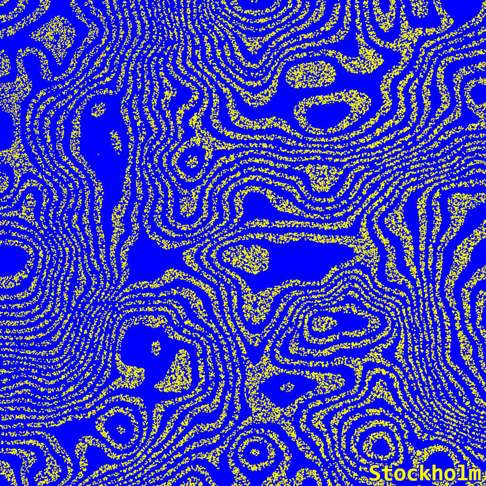
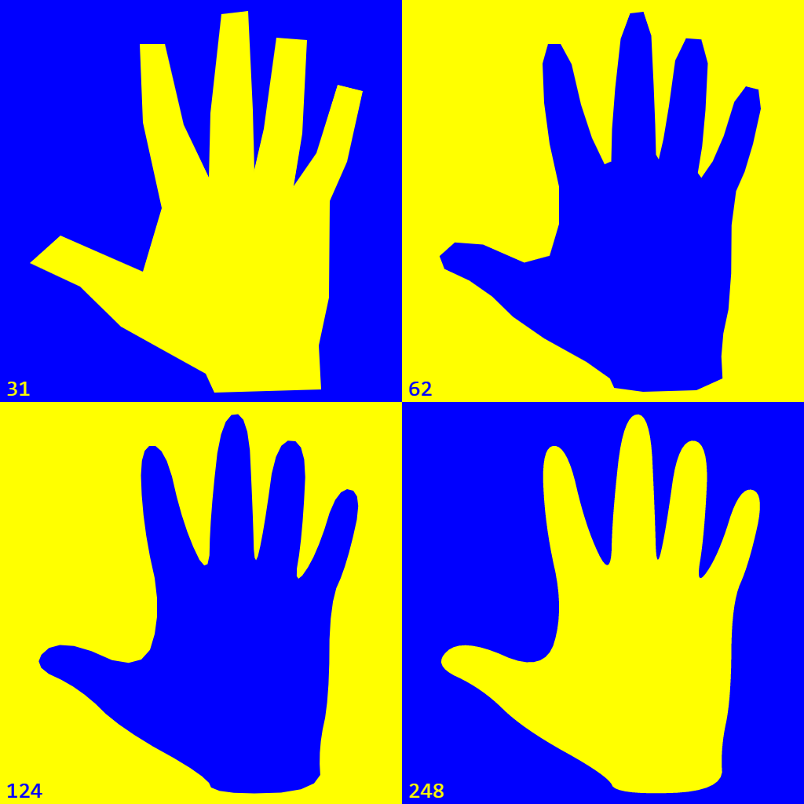
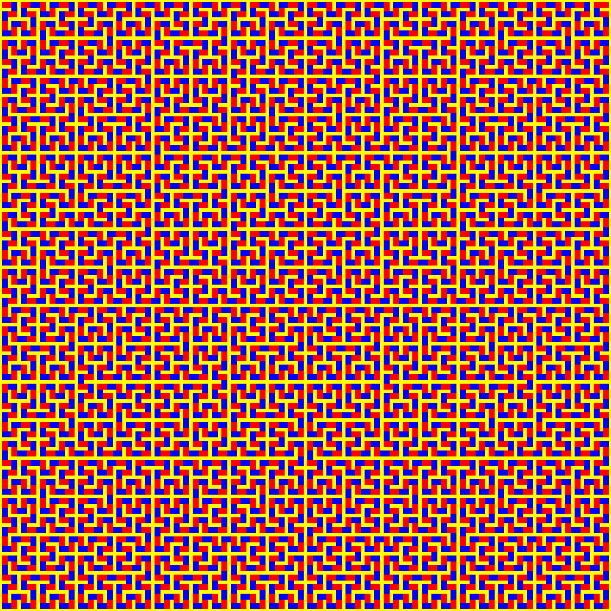

# genuary2021

Sketches made daily during 30 days for <a href = "https://genuary2021.github.io/">Genuary 2021</a>.  
I gave myself extra constraints:
- use only blue `rgb(0, 0, 255)` and yellow `rgb(255, 255, 0)` (not respected on days ;
- 1:1 format;
- no animation.


## Prompts and results

### JAN.1
>`// TRIPLE NESTED LOOP`


### JAN.2
> Rule 30 (elementary cellular automaton)



### JAN.3
> Make something human.


### JAN.4
> Small areas of symmetry.


### JAN.5
> Do some code golf! How little code can you write to make something interesting? Share the sketch and its code together if you can.


### JAN.6
> Triangle subdivision.


### JAN.7
> Generate some rules, then follow them by hand on paper.  

 

### JAN.8
> Curve only.


### JAN.9
> Interference patterns.


### JAN.10
> `// TREE`


### JAN.11
> Use something other than a computer as an autonomous process (or use a non-computer random source).


### JAN.12
> Use an API (e.g. the weather). Here’s a huge list of free public APIs.  

   
 

### JAN.13
> Do not repeat.


### JAN.14
> `// SUBDIVISION`



### JAN.15
> Let someone else decide the general rules of your piece.


### JAN.16
> Circles only


### JAN.17
> Draw a line, pick a new color, move a bit.



### JAN.18
> One process grows, another process prunes.


### JAN.19
> Increase the randomness along the Y-axis.


### JAN.20
> No loops.


### JAN.21
> ```
>function f(x) {  
>   DRAW(x);  
>   f(1 * x / 4);  
>   f(2 * x / 4);  
>   f(3 * x / 4);  
>}
> ```


### JAN.22
> Draw a line. Wrong answers only.


### JAN.23
> #264653 #2a9d8f #e9c46a #f4a261 #e76f51, no gradients.  
> Optionally, you can use a black or white background.


### JAN.24
> 500 lines.


### JAN.25
> Make a grid of permutations of something.


### JAN.26
> 2D Perspective.


### JAN.27
> Monochrome gradients without lines.


### JAN.28
> Use sound.


### JAN.29
> Any shape, none can touch.


### JAN.30
> Replicate a natural concept (e.g. gravity, flocking, path following).


### JAN.31
> ```
>10 SEARCH FOR "ENO'S OBLIQUE STRATEGIES"  
>20 OBTAIN ONE  
>30 THAT IS YOUR PROMPT FOR TODAY
> ```  
∅
